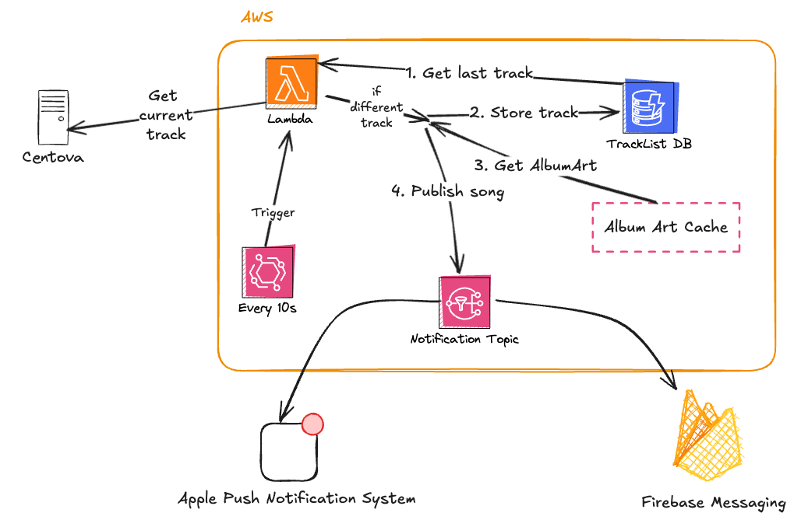
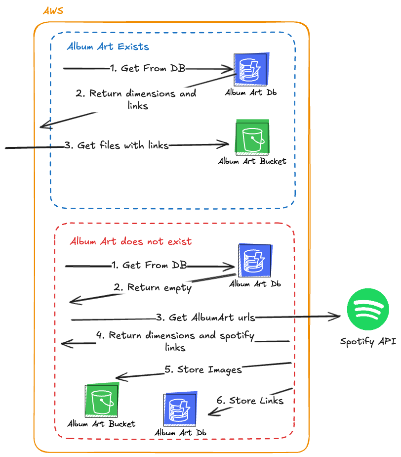
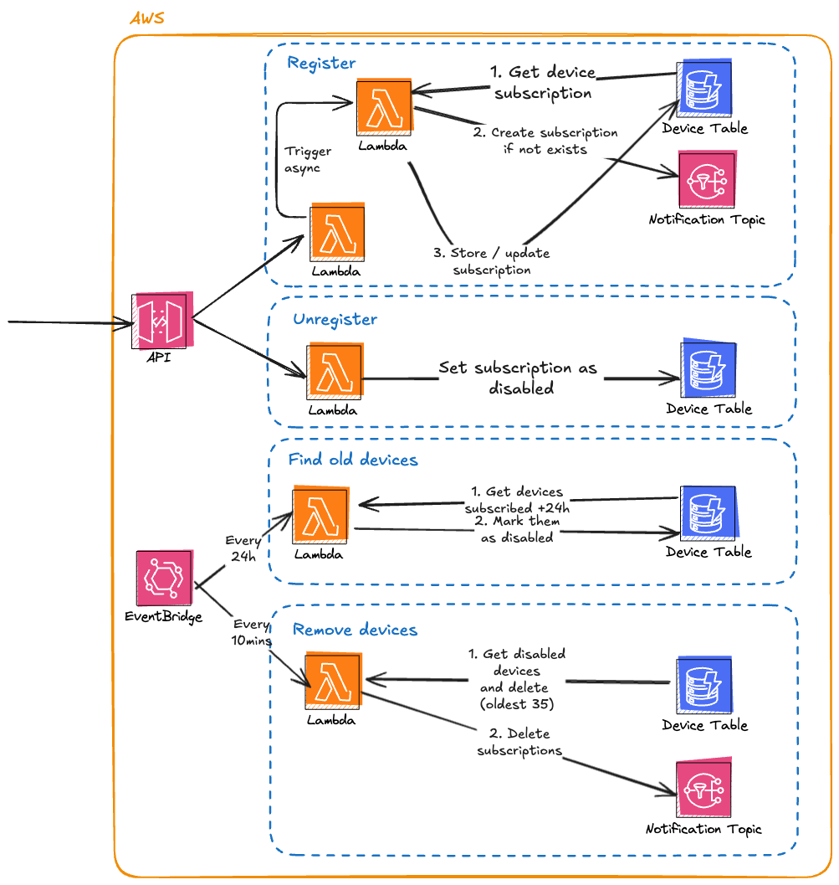
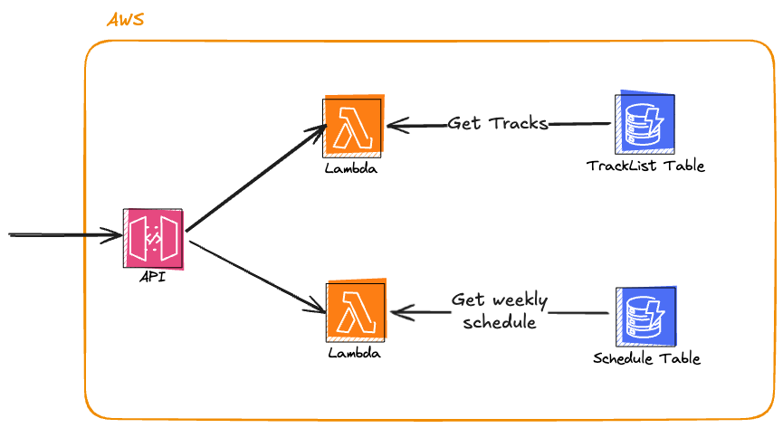

# BN Mallorca  

Backend and infrastructure for the BN Mallorca Radio App.

## Technology Stack

- **Infrastructure**: AWS CDK (TypeScript)
- **Runtime**: Node.js with TypeScript
- **AWS Services**: Lambda, DynamoDB, S3, SNS, SQS, Secrets Manager, API Gateway
- **External APIs**: Spotify API, Icecast metadata streaming
- **Code Quality**: Biome (linter/formatter)

## Key Features

- **Track Polling**: Continuously polls Icecast metadata streams to track currently playing songs, storing track history in DynamoDB
- **Track List API**: Exposes recently played tracks via REST API
- **Album Art Caching**: Fetches and caches album artwork using Spotify API, stores in S3
- **Device Subscriptions**: Manages push notification subscriptions for mobile devices via SNS
- **Radio Schedule**: Provides radio programming schedule endpoints

## Project Structure

```
bn_mallorca_backend/
├── bin/                    # CDK app entry point
├── lib/                    # CDK infrastructure code
│   └── constructs/         # CDK constructs
├── src/
│   ├── function/           # Lambda function handlers
│   │   ├── album-art/      # Album art caching
│   │   ├── device/         # Device registration and cleanup
│   │   ├── schedule/       # Radio schedule endpoint
│   │   └── track/          # Track polling and track list API
│   ├── net/                # External service clients (Spotify, S3, SNS, etc.)
│   ├── repository/         # Data access layer (DynamoDB)
│   ├── service/            # Business logic
│   └── helpers/            # Utility functions
├── docs/                   # Architecture diagrams
└── open-api.v1.json        # API specification
```

## Development

```bash
# Install dependencies
bun install

# Build
bun run build

# Linting
bun run biome        # Check code
bun run biome:fix    # Auto-fix issues

# CDK operations
bun run cdk deploy
bun run cdk synth

# Generate OpenAPI types
bun run generate:openapi
```

## Related Projects

- [BN Mallorca Android App](https://github.com/xiscosc/bnmallorca-android) - Android client application

## API Spec

[](open-api.v1.json)

## Architecture Diagrams

### Track Polling


### Album Art Cache


### Device Subscription


### Other Endpoints

