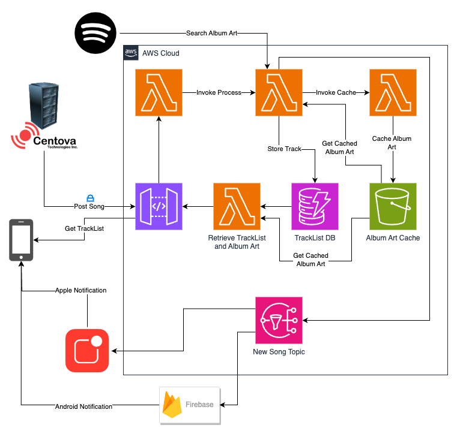

# BN Mallorca  

Backend and infrastructure for the BN Mallorca Radio App.

- Infrastructure described in AWS CDK - Typescript.
- Functions implemented in Node JS.

### API Spec

### Architecture diagram
